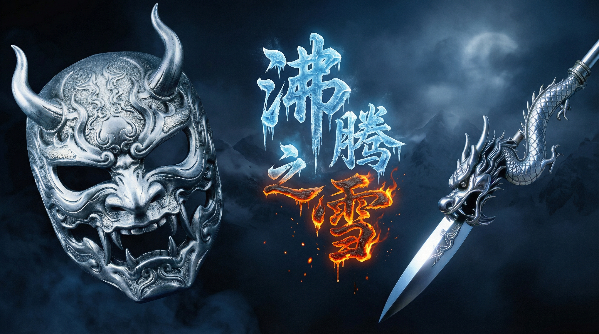

# 🏔️ Boiling-Snow-TTS
> **工业级武侠语音合成引擎 | 专为 Apple Silicon 深度优化 | 基于 Qwen3-TTS**

<p align="center">
  
</p>

[](LICENSE)
[](pyproject.toml)
[-black.svg)](#-硬件加速优化-hardware-acceleration)

**Boiling-Snow-TTS** 是一个面向专业创作的 AI 配音解决方案。它不仅继承了阿里巴巴 Qwen3-TTS 的核心生成能力，更针对影视创作流程进行了深度重构，旨在为《沸腾之雪》等高品质武侠内容提供具备“灵魂”的中文配音。

---

## 🚀 核心卖点：为什么选择本项目？

### 1. Apple Silicon 原生性能巅峰
原版 TTS 项目通常强依赖 NVIDIA 的 CUDA 环境。本项目通过底层改造，实现了对 **Apple M 芯片** 的原生支持。利用 **MPS (Metal Performance Shaders)** 与 **SDPA (Scaled Dot Product Attention)**，在 MacBook M3 Pro 等设备上实现了秒级的成品产出，彻底告别“Mac 跑大模型像幻灯片”的历史。

### 2. 导演级“剧本即生成”流转
首创 **JSON 驱动架构**。创作者无需接触 Python 代码，通过修改 `configs/config.json` 即可统筹管理情感表达、角色路由与自动化交付。

### 3. AI 资产原子化自理
内置 **AI 自动音频预处理** 模块。当您投入一段长参考音频时，引擎会自动检测音质并裁剪出最佳的 **8-10 秒克隆黄金片段**，消除了繁琐的手工剪辑环节。

---

## 🐣 小白 3 分钟快速上手 (3-Min Quick Start)

本项目的核心理念是：**让不懂代码的创作者也能轻松驾驭顶级 TTS。**

### 第一步：一键“激活”工坊
打开终端，粘贴运行以下命令（自动装环境、下模型）：
```bash
chmod +x install.sh && ./install.sh
```

### 第二步：像写剧本一样改配置
找到项目里的 `configs/config.json`，把你想说的话填进去：
- `text`: 想让 AI 说的话。
- `emotion`: 想要的情绪（比如：深沉、悲伤、激昂）。
- `persona`: 想要的声音（默认用 `narrator` 说书人）。

### 第三步：一键收片
在终端运行：
```bash
source .venv/bin/activate
python main.py
```
**恭喜！** 你的配音成品已经躺在 `assets/output_audio/` 目录里等着你啦！🎉

---

## ⚔️ 核心功能模块 (Core Modules)

| 模式 | 技术原理 | 适用场景 |
| :--- | :--- | :--- |
| **声音克隆 (Base)** | 零样本 (Zero-shot) 音色复刻 | 100% 还原特定演员/说书人的音色 |
| **音色设计 (VoiceDesign)** | 自然语言指令驱动生成 | 凭空创造全新的武侠角色（如：苍老、邪魅） |
| **官方精品 (CustomVoice)** | 预设高质量算子调用 | 快速为配角、路人提供稳定的音质输出 |

---

## 🛠️ 硬件加速优化 (Hardware Acceleration)

本项目核心脚本 `main.py` 已针对 **Apple Silicon (M1/M2/M3)** 芯片进行深度原生优化：

- **MPS (Metal Performance Shaders) 加速**：自动探测并启用 Mac GPU 进行矩阵运算。
- **SDPA (Scaled Dot Product Attention)**：强制启用原生注意力机制加速，绕过 NVIDIA 专用限制。
- **bfloat16 精度优化**：在 M 芯片上大幅降低内存占用，保持 1.7B 大模型高音质输出。

---

## 🤖 模型架构矩阵 (Model Gallery)

项目中 `models/` 目录下包含 4 个配音引擎，按“功能”与“体量”划分为两个梯队：

### 1. Base 家族 (声音克隆引擎 - 核心)
专门用于**复刻/克隆**您提供的参考音频（如说书人音色）。
- **Base-0.6B**：轻量级。速度极快，内存占用低（~2GB），适合创作初期快速生成样音。
- **Base-1.7B**：**全量级 (推荐)**。成品级音质，支持 `emotion` 和 `tone` 指令控制。

### 2. CustomVoice 家族 (官方精品音色库)
内置了 9 种官方预设的精品音色，无需参考音频即可直接调用。
- **CustomVoice-0.6B/1.7B**：预设音色的轻量/全量版。音质稳定饱满。

### 3. VoiceDesign 家族 (音色设计引擎)
专门用于**凭空创造**全新音色。您只需提供一段文字描述（如“50岁深沉男声”），AI 即可生成。
- **VoiceDesign-1.7B**：全量设计引擎。支持极其细腻的角色塑造。

---

## 📥 模型下载 (Model Downloads)

由于权重文件较大，请根据需要下载并放置在 `models/` 相应目录中：

| 模型名称 | 对应目录 |
| :--- | :--- |
| [Qwen3-TTS-12Hz-1.7B-Base](https://modelscope.cn/models/Qwen/Qwen3-TTS-12Hz-1.7B-Base) | `models/Base-1.7B` |
| [Qwen3-TTS-12Hz-1.7B-VoiceDesign](https://modelscope.cn/models/Qwen/Qwen3-TTS-12Hz-1.7B-VoiceDesign) | `models/VoiceDesign-1.7B` |

---

## 🛠️ 快速开始 (Quick Start)

### 1. 环境准备 (Prerequisites)
需安装 **FFmpeg**（用于音频处理）。
- Mac: `brew install ffmpeg`
- Linux: `sudo apt install ffmpeg`

### 2. 文案配置
编辑 `configs/config.json`。

### 3. 启动引擎
```bash
source .venv/bin/activate
python main.py
```

---

## 🗺️ 路线图 (Roadmap)
- [x] Apple Silicon (M-Series) 硬件加速优化
- [x] AI 自动参考音频裁剪逻辑
- [x] 多模式智能路由引擎
- [ ] 批量剧本文案自动生成排队系统
- [ ] Web 端可视化配置界面 (Gradio 深度集成)

---

## 📜 开源协议与鸣谢
本项目基于阿里巴巴 **Qwen3-TTS** 二次开发，遵循 [Apache-2.0 License](LICENSE)。

---
*一笔写风月，一心藏滚烫。*
